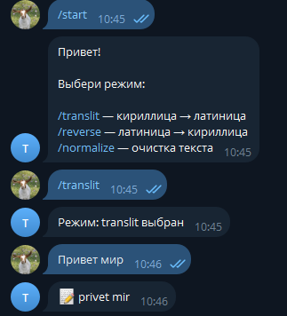
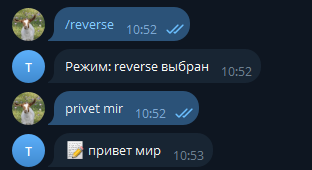
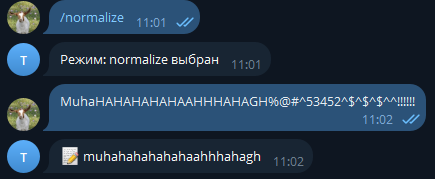

# Telegram Bot + Mygem

## 📌 Описание

Бот для обработки текста с использованием собственного гема `Mygem`.

Поддерживает:
- 🔤 translit (кириллица → латиница)
- 🔁 reverse_translit (латиница → кириллица)
- 🧹 normalize (очистка текста)

## 🚀 Запуск

Бот уже доступен в Telegram:

👉 https://t.me/TranscriptRuby_bot

Чтобы начать работу:
/start

Далее выбери режим:

/translit — кириллица → латиница
/reverse — латиница → кириллица
/normalize — очистка текста

После выбора режима просто отправь текст

## 💬 Примеры использования

### translit режим

### reverse режим

### normolize режим
